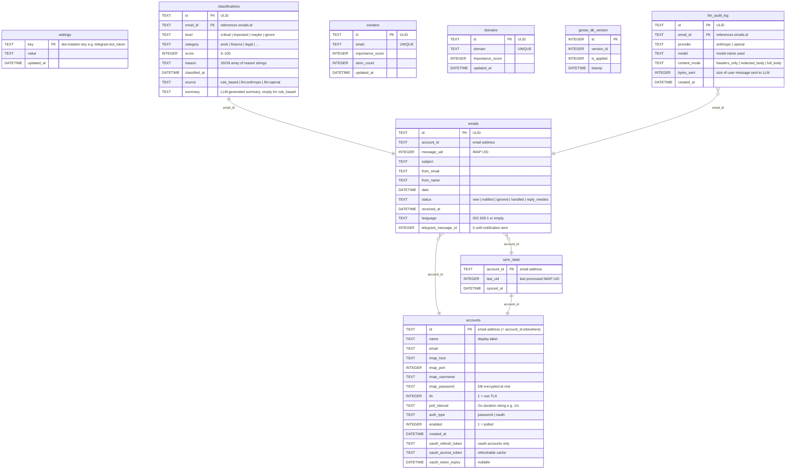

# db-schema.md

> **Keep this file up to date.** Update the ERD whenever a new migration is added.

Current schema reflects migrations up to: `008_oauth_tokens.sql`

```mermaid
erDiagram
    emails {
        TEXT id PK "ULID"
        TEXT account_id "email address"
        INTEGER message_uid "IMAP UID"
        TEXT subject
        TEXT from_email
        TEXT from_name
        DATETIME date
        TEXT status "new | notified | ignored | handled | reply_needed"
        DATETIME received_at
        TEXT language "ISO 639-1 or empty"
        INTEGER telegram_message_id "0 until notification sent"
    }

    sync_state {
        TEXT account_id PK "email address"
        INTEGER last_uid "last processed IMAP UID"
        DATETIME synced_at
    }

    settings {
        TEXT key PK "dot-notation key e.g. telegram.bot_token"
        TEXT value
        DATETIME updated_at
    }

    accounts {
        TEXT id PK "email address (= account_id elsewhere)"
        TEXT name "display label"
        TEXT email
        TEXT imap_host
        INTEGER imap_port
        TEXT imap_username
        TEXT imap_password "DB encrypted at rest"
        INTEGER tls "1 = use TLS"
        TEXT poll_interval "Go duration string e.g. 1m"
        TEXT auth_type "password | oauth"
        INTEGER enabled "1 = polled"
        DATETIME created_at
        TEXT oauth_refresh_token "oauth accounts only"
        TEXT oauth_access_token "refreshable cache"
        DATETIME oauth_token_expiry "nullable"
    }

    classifications {
        TEXT id PK "ULID"
        TEXT email_id FK "references emails.id"
        TEXT level "critical | important | maybe | ignore"
        TEXT category "work | finance | legal | ..."
        INTEGER score "0–100"
        TEXT reason "JSON array of reason strings"
        DATETIME classified_at
        TEXT source "rule_based | llm:anthropic | llm:openai"
        TEXT summary "LLM-generated summary; empty for rule_based"
    }

    senders {
        TEXT id PK "ULID"
        TEXT email "UNIQUE"
        INTEGER importance_score
        INTEGER seen_count
        DATETIME updated_at
    }

    domains {
        TEXT id PK "ULID"
        TEXT domain "UNIQUE"
        INTEGER importance_score
        DATETIME updated_at
    }

    goose_db_version {
        INTEGER id PK
        INTEGER version_id
        INTEGER is_applied
        DATETIME tstamp
    }

    llm_audit_log {
        TEXT id PK "ULID"
        TEXT email_id FK "references emails.id"
        TEXT provider "anthropic | openai"
        TEXT model "model name used"
        TEXT content_mode "headers_only | redacted_body | full_body"
        INTEGER bytes_sent "size of user message sent to LLM"
        DATETIME created_at
    }

    emails }o--|| sync_state : "account_id"
    emails }o--|| accounts : "account_id"
    sync_state ||--|| accounts : "account_id"
    classifications ||--|| emails : "email_id"
    llm_audit_log }o--|| emails : "email_id"
```
